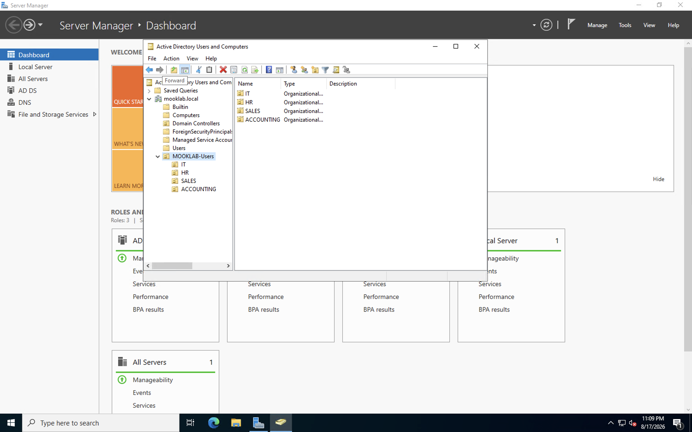
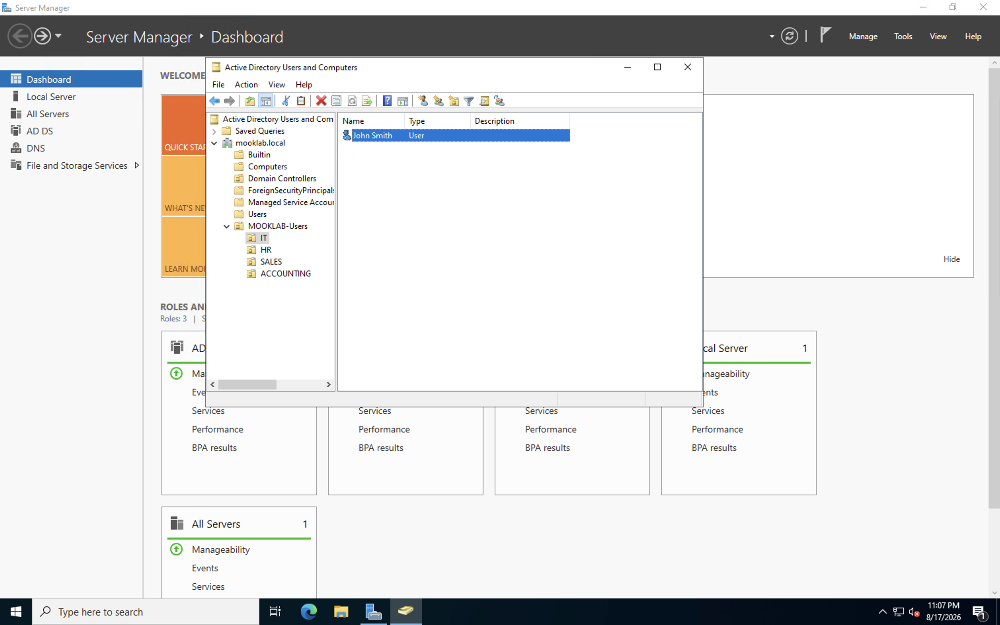
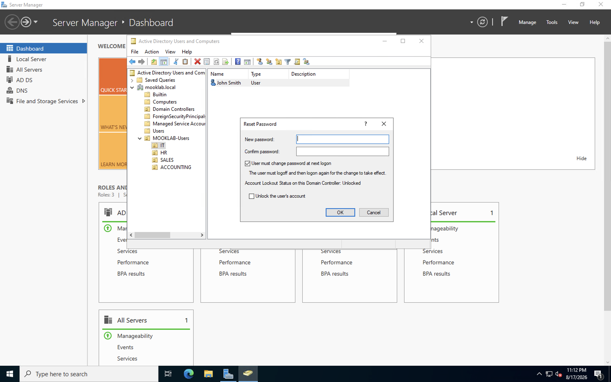
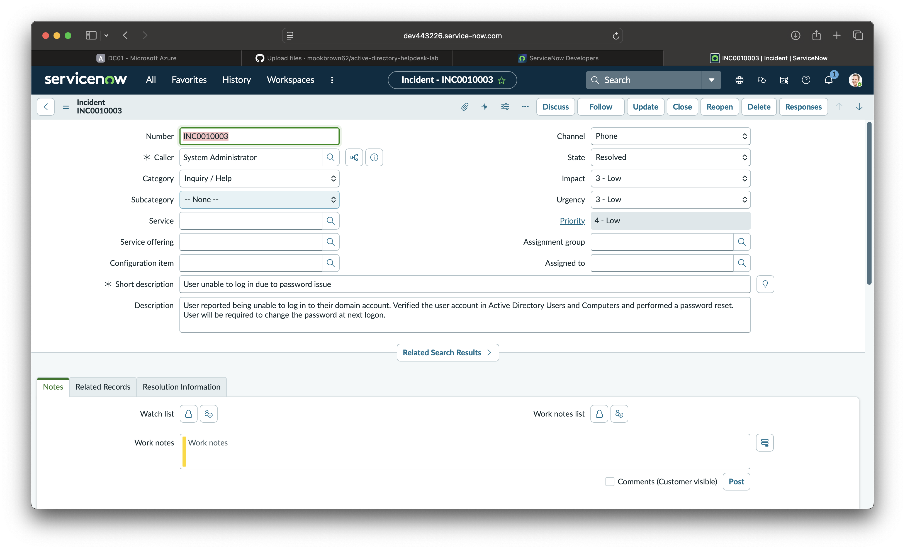
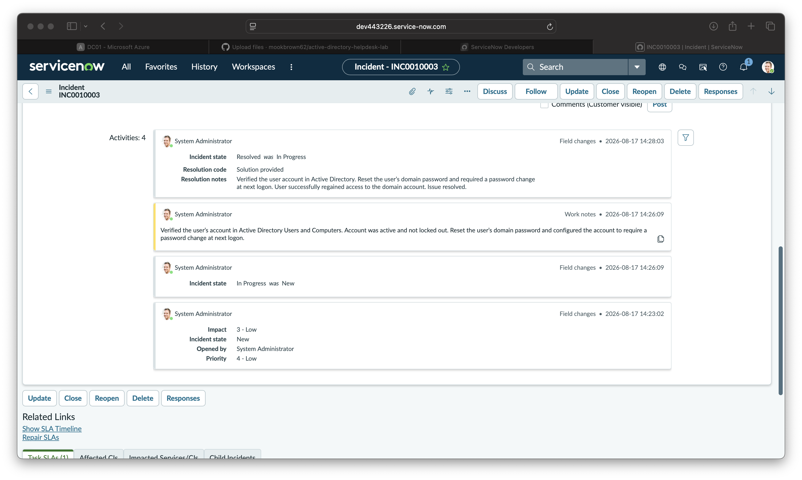
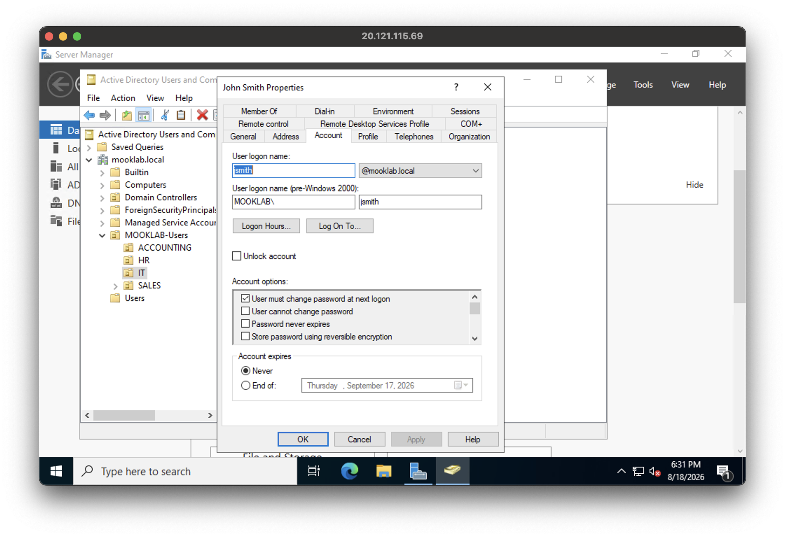
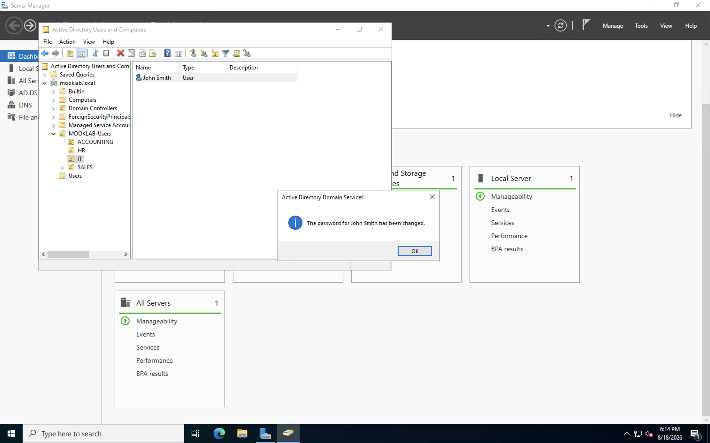
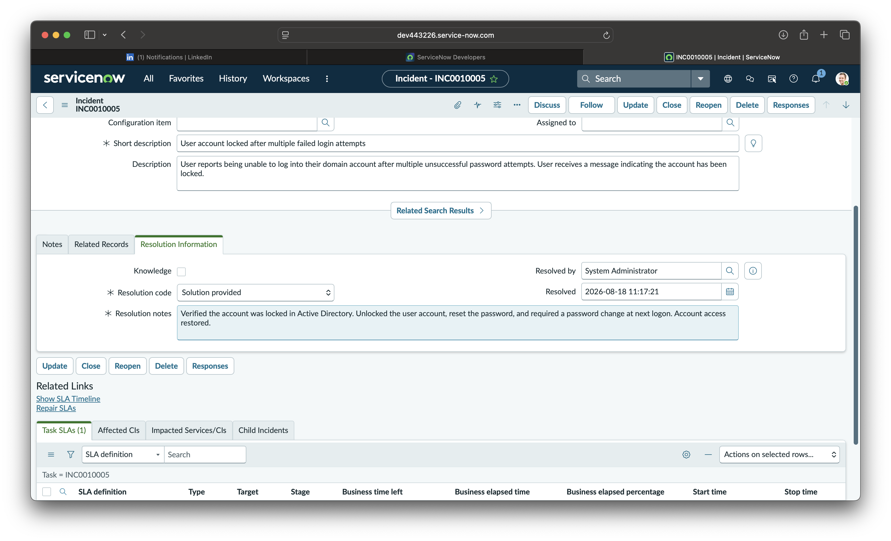

# Active Directory Help Desk Lab

## Project Overview

This project demonstrates a hands-on IT Help Desk environment using Windows Server, Active Directory Domain Services, and ServiceNow.

The lab simulates common Level 1 Help Desk responsibilities including user account administration, password resets, Active Directory troubleshooting, and incident documentation.

## Technologies Used

- Windows Server 2022
- Active Directory Domain Services (AD DS)
- DNS
- Active Directory Users and Computers (ADUC)
- ServiceNow
- Microsoft Azure
- macOS

## Lab Environment

**Domain:** mooklab.local  
**Domain Controller:** DC01

Organizational Units (OUs) were created to simulate departments within an organization:

- IT
- HR
- Sales
- Accounting

## Help Desk Scenario #1 — Password Reset

### Issue

A user reported being unable to log into their domain account because of a password issue.

### Troubleshooting & Resolution

1. Received and documented the incident in ServiceNow.
2. Located the user's account in Active Directory Users and Computers.
3. Verified the account status.
4. Performed a domain password reset.
5. Configured the account to require a password change at next logon.
6. Documented troubleshooting steps in ServiceNow work notes.
7. Added resolution notes.
8. Resolved the incident after restoring account access.

## Skills Demonstrated

- Active Directory administration
- User account management
- Password resets
- Organizational Unit management
- Windows Server administration
- ServiceNow incident management
- Ticket documentation
- Troubleshooting
- Technical documentation

## Future Labs

Additional Help Desk scenarios will be added to this repository, including account lockouts, user provisioning, group membership, permissions, and other common IT support issues.

## Lab Screenshots

### 1. Active Directory Organizational Units
Created and organized Organizational Units (OUs) in Active Directory to simulate a business environment.

### 2. Active Directory User Account
Located and managed a domain user account using Active Directory Users and Computers.

### 3. Password Reset
Performed a password reset and configured the user to change their password at the next logon.

### 4. ServiceNow Incident
Created and documented a ServiceNow incident for a user experiencing a domain login/password issue.

### 5. ServiceNow Resolution
Documented troubleshooting steps and resolution information before resolving the ServiceNow incident.

## Lab Outcome

Successfully simulated an end-to-end Help Desk support workflow by receiving a user issue, documenting the incident in ServiceNow, troubleshooting the user's Active Directory account, resetting the password, restoring access, documenting the resolution, and closing the incident.

---

## Help Desk Scenario 2: Account Lockout

### Issue
A user reported being unable to log into their domain account after multiple failed login attempts.

### Troubleshooting & Resolution
1. Located the user account in Active Directory Users and Computers.
2. Verified the account lockout status.
3. Unlocked the user account.
4. Reset the user's password.
5. Enabled "User must change password at next logon."
6. Documented the troubleshooting and resolution in ServiceNow.
7. Resolved the incident after restoring account access.

### Screenshots

#### Active Directory Account

#### Password Reset Confirmation

#### ServiceNow Incident Resolution

### Skills Demonstrated
- Active Directory administration
- Account lockout troubleshooting
- Password resets
- User account management
- ServiceNow incident management
- Ticket documentation
- Technical troubleshooting
